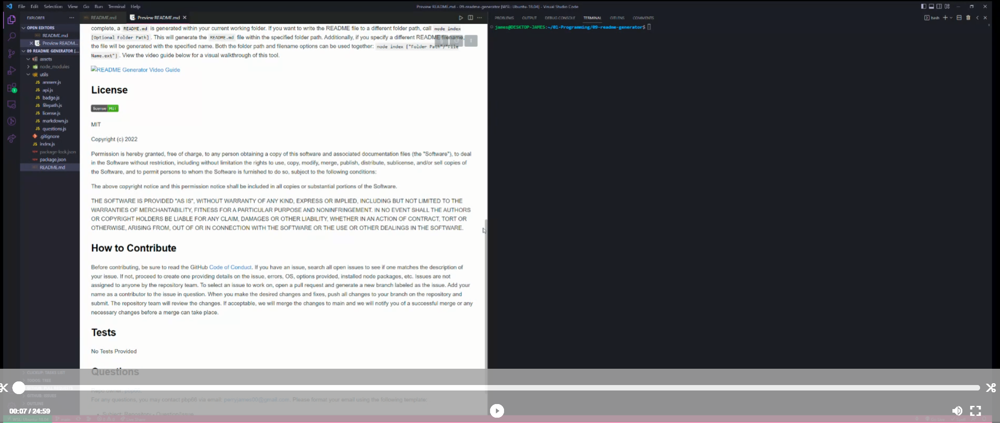

# Simple Readme Generator

## Description

User Story: 
As a user, I want a README generator so that I can quickly create a professional README for a new project. 

Acceptance Criteria:
Given a command-line application that accepts user input, when I am prompted for information about my application repository, a high-quality, professional README.md is generated with the title of my project and sections entitled description, table of contents, installation, usage, license, contributing, tests, and questions. When I enter my project title, the README project title is updated with the user input. When I enter content for each of the sections, each section is filled with the content specified by the user. When I select a license for the project, a badge is added in the README and a notice is added within the license section. When given a GitHub username, this is added to the questions section with a link to their GitHub profile. When given an email, instructions are added to reach the repository owner at the given email address. When I click on links in the table of contents, I'm taken to the corresponding section in the README.

Creating a professional README.md can be a lengthy process when considering all of the formatting, links, and content to add. Creating a simple README generator eases this process of generating one. Some media content needs to be added manually as well as the license content link, but the README.md generates and fetches most of this content already, saving the user time when creating a README.md from scratch. 

I enjoyed working with NodeJS, especially for my first project with it. To aid in the auto-generation of content, I researched several built-in modules as will as several other npm packages. I found that I only needed two node packages: axios and inquirer. Both were simple and straightforward to implement, but could be powerful. I practiced ES5 exporting/importing as I created several modules to contain several user generated classes. 

Looking to the future, I want this tool to add media from within the project folders, improve upon the included simple License API class, auto-fetch GitHub username and email from the local git repository (if installed), auto-generate nicely formatted links, handle code blocks, and add tests. A longer road map is in development, but the several items above give it a great start.

## Table of Contents

1. [Installation](#installation)
2. [Usage](#usage)
3. [License](#license)
4. [Contribute](#contribute)
5. [Tests](#tests)
6. [Questions](#questions)

## Installation

From GitHub, clone the repository onto your local machine. Navigate to the install directory and run npm install. If npm is not installed, you will need to install it for your local machine first. After npm has installed the necessary modules, the program is ready to run.

## Usage

From your command-line, run `node index`. This will prompt the user to enter information on each of the README sections. After the prompts are complete, a `README.md` is generated within your current working folder. If you want to write the README file to a different folder path, call `node index [Optional Folder Path]`. This will generate the `README.md` file within the specified folder path. Additionally, if you specify a different README filename, the file will be generated with the specified name. Both the folder path and filename options can be used together: `node index ["Folder Path"/"File Name.ext"]`. View the video guide below for a visual walkthrough of this tool.

## License

MIT

Copyright (c) 2022

Permission is hereby granted, free of charge, to any person obtaining a copy of this software and associated documentation files (the "Software"), to deal in the Software without restriction, including without limitation the rights to use, copy, modify, merge, publish, distribute, sublicense, and/or sell copies of the Software, and to permit persons to whom the Software is furnished to do so, subject to the following conditions:

The above copyright notice and this permission notice shall be included in all copies or substantial portions of the Software.

THE SOFTWARE IS PROVIDED "AS IS", WITHOUT WARRANTY OF ANY KIND, EXPRESS OR IMPLIED, INCLUDING BUT NOT LIMITED TO THE WARRANTIES OF MERCHANTABILITY, FITNESS FOR A PARTICULAR PURPOSE AND NONINFRINGEMENT. IN NO EVENT SHALL THE AUTHORS OR COPYRIGHT HOLDERS BE LIABLE FOR ANY CLAIM, DAMAGES OR OTHER LIABILITY, WHETHER IN AN ACTION OF CONTRACT, TORT OR OTHERWISE, ARISING FROM, OUT OF OR IN CONNECTION WITH THE SOFTWARE OR THE USE OR OTHER DEALINGS IN THE SOFTWARE.

## How to Contribute

Before contributing, be sure to read the GitHub [Code of Conduct](https://github.com/github/docs/blob/main/CODE_OF_CONDUCT.md). If you have an issue, search all open issues to see if one matches the description of your issue. If not, proceed to create one providing details on the issue, errors, OS, options provided, installed node packages, etc. Issues are not assigned to anyone by the repository team. To select an issue to work on, open a pull request and generate a new branch labeled as the issue. Add your name as a contributor to the issue in question. When you make the desired changes and fixes, push all changes to your branch on the repository and submit. The repository team will review the changes. If acceptable, we will merge the changes to main and we will notify you of a successful merge or any necessary changes before a merge can take place.

## Tests

No Tests Provided

## Questions

Repo owner: [pbp66](https://github.com/pbp66).
For any questions, you may contact pbp66 via email: perryjames00@gmail.com. Please format your email using the following template:

- Subject: Repository - Question/Issue
- Body: Summarize the issue with a brief description for the first paragraph. Additional paragraphs can be used for a long description, if needed. Include any errors when using this project
- Signature: Please leave an email address so that any updates are sent get back to you.

